# CyberComplaint

**A guided cybercrime complaint assistant for Indian citizens.**

> Built by [Ashutosh Kumar](https://github.com/ashutoshkumar) and [Kaustubh Tripathi](https://github.com/kaustubhtripathi) for the [Build What Moves India](https://buildwhatmovesindia.com) hackathon.

---

## Problem

India's National Cyber Crime Reporting Portal (NCRP) handles **22.5 lakh complaints per year** — 78% are financial fraud. The portal is plagued by:

- **Session timeouts** that erase all progress mid-complaint
- **Broken OTP/Captcha** fields that reject valid input
- **Zero post-filing guidance** — citizens don't know what "disposed" means
- **No autosave** — 8+ attempts to file a single complaint is common
- **No mobile optimization** — useless on the devices most Indians actually use

Victims lose an average of ₹1.4L per fraud. The first hour is critical — recovery drops from 52% to 6% after 24 hours. The current portal wastes that window.

## Solution

CyberComplaint replaces the confusing multi-step form with a **guided, auto-saving wizard** that:

1. Walks citizens through complaint filing in ~5 minutes
2. Auto-saves progress to localStorage (resume anytime)
3. Shows a **golden hour timer** for financial fraud
4. Generates a **PDF receipt** with complaint details
5. Provides **post-filing next steps** (call 1930, visit PS, RTI escalation)
6. Works on **mobile, slow connections, low digital literacy**

## Screenshots

### Landing Page

| Hero | Problem Statement | How It Works |
|------|-------------------|--------------|
| 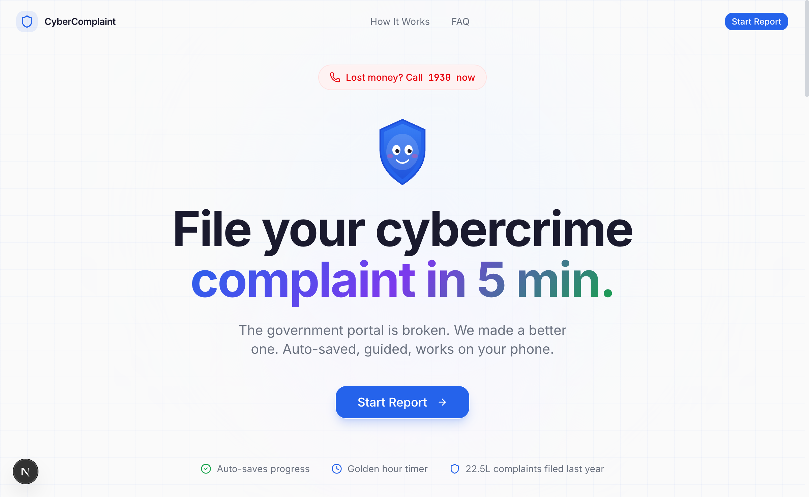 | 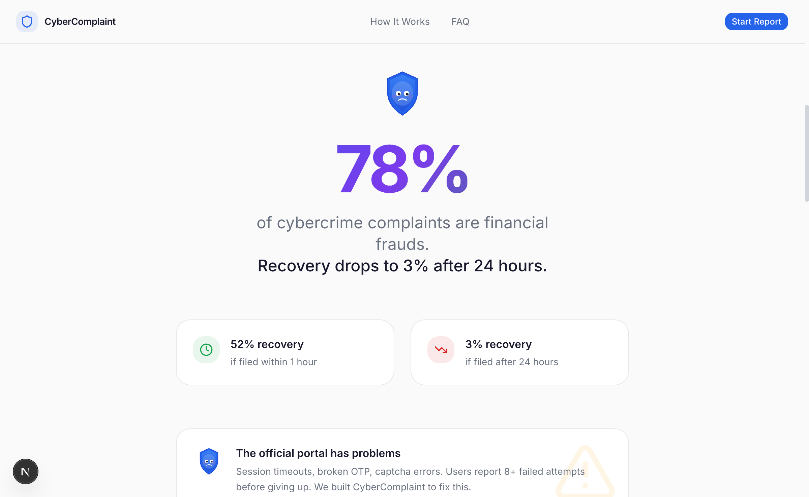 | 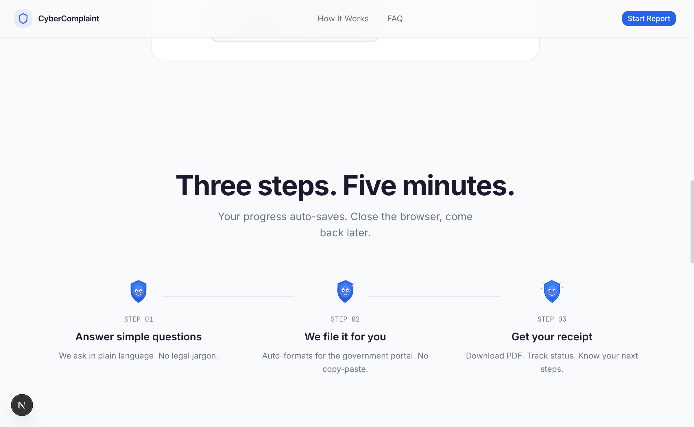 |

| FAQ | Footer & Emergency Numbers |
|-----|---------------------------|
| 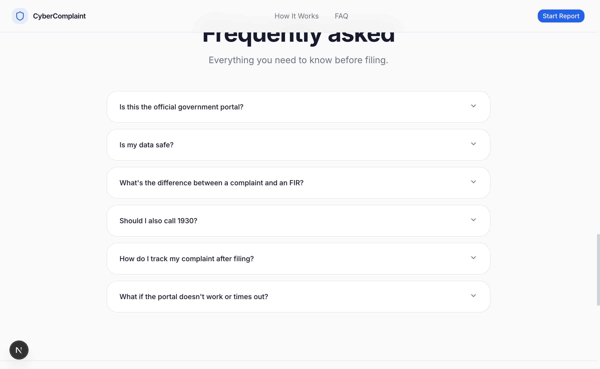 | 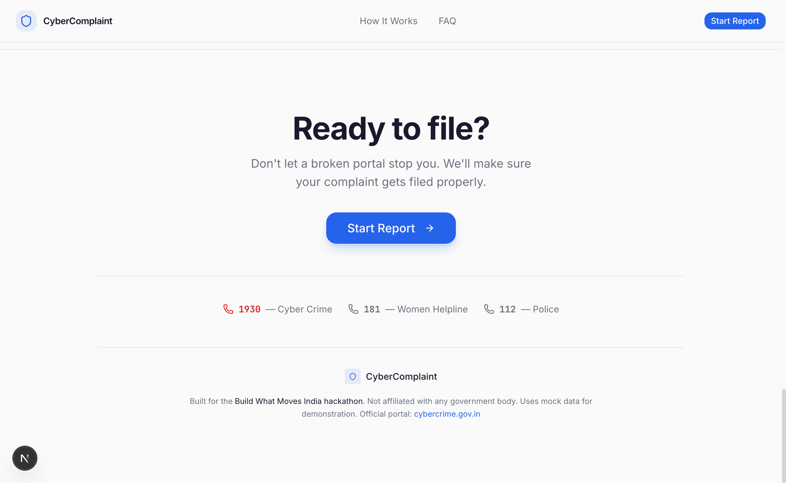 |

### Report Wizard

| Welcome | Step 1: Category | Category Selected |
|---------|------------------|-------------------|
| 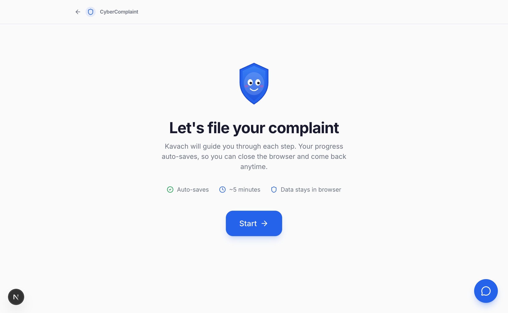 | 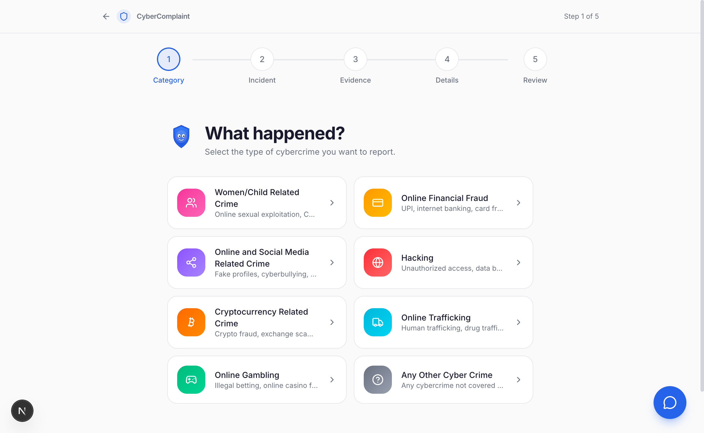 | 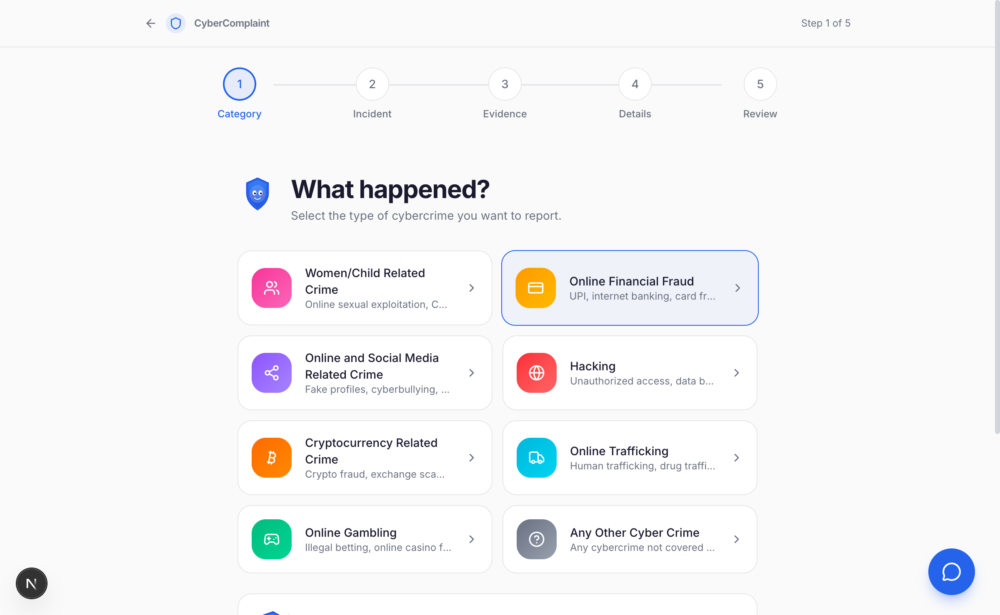 |

| Step 2: Incident | Step 3: Evidence | Step 4: Details | Step 5: Review |
|------------------|------------------|-----------------|----------------|
| 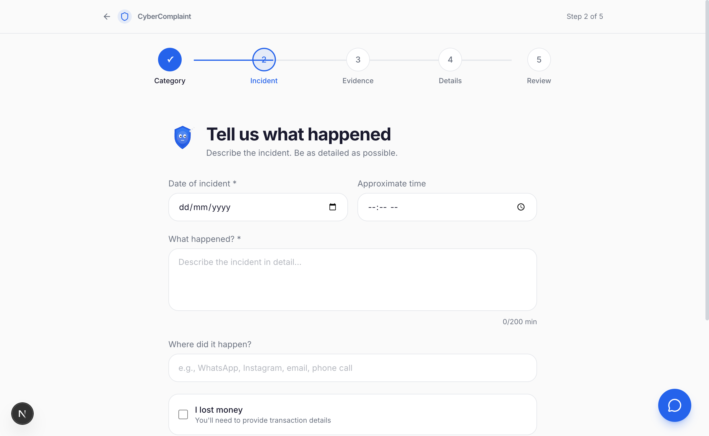 | 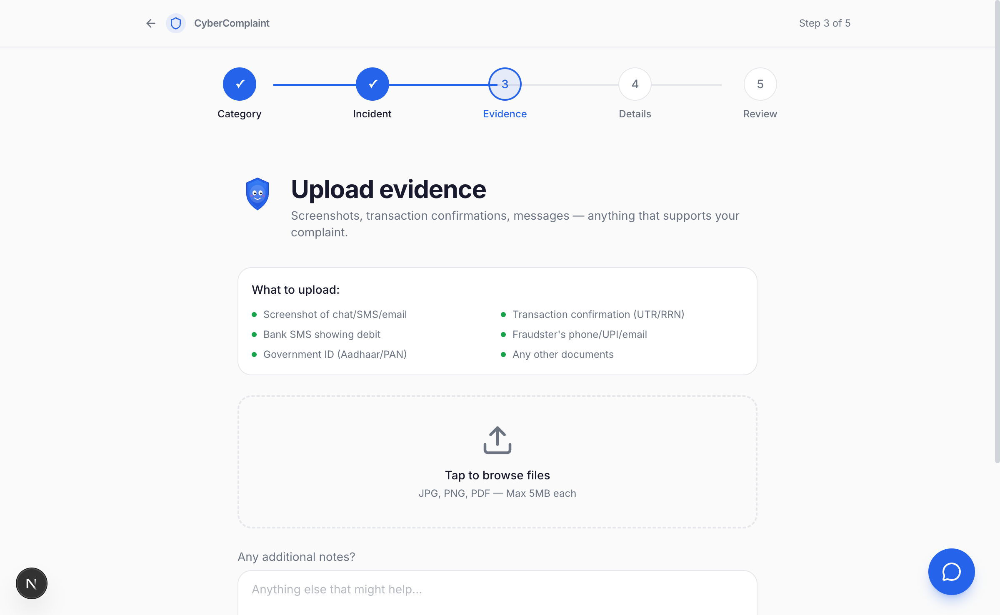 | 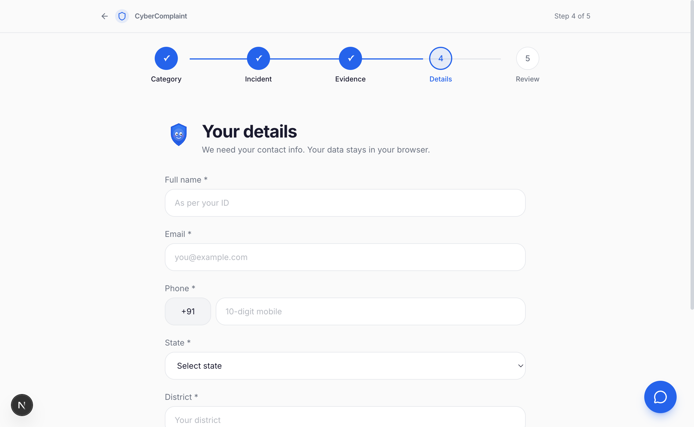 | 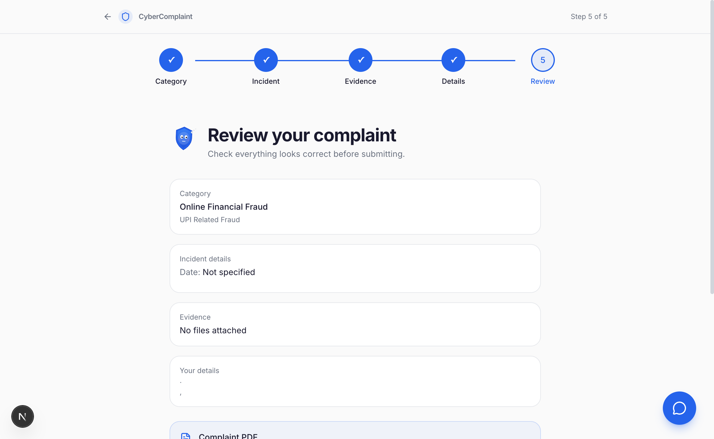 |

### Full Page

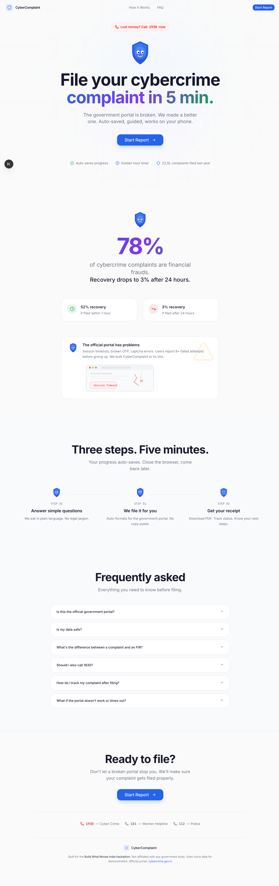

## Architecture

```
src/
├── app/
│   ├── layout.tsx              # Root layout, fonts, metadata
│   ├── page.tsx                # Landing page (6 server components)
│   └── report/
│       ├── layout.tsx          # Report wizard layout
│       ├── page.tsx            # Welcome / intro screen
│       ├── category/page.tsx   # Step 1: Crime category + sub-category
│       ├── incident/page.tsx   # Step 2: Incident details (date, amount, description)
│       ├── evidence/page.tsx   # Step 3: Evidence upload + AI extraction
│       ├── details/page.tsx    # Step 4: Personal details (victim info)
│       └── review/page.tsx     # Step 5: Review + PDF generation
├── components/
│   ├── sections/               # Landing page sections (Server Components)
│   │   ├── Hero.tsx
│   │   ├── Problem.tsx
│   │   ├── HowItWorks.tsx
│   │   ├── Benefits.tsx
│   │   ├── FAQ.tsx
│   │   └── Footer.tsx
│   ├── ui/                     # shadcn/ui primitives
│   └── Kavach.tsx              # Mascot component
└── lib/
    ├── constants.ts            # Crime categories, step config
    ├── generate-pdf.ts         # PDF receipt generation (jsPDF)
    ├── use-report-data.ts      # Shared wizard state (localStorage)
    └── utils.ts                # cn() helper
```

## Tech Stack

| Layer | Technology |
|-------|------------|
| Framework | Next.js 15 (App Router) |
| Language | TypeScript |
| Styling | Tailwind CSS v4 |
| Components | shadcn/ui |
| Animations | Framer Motion |
| PDF Generation | jsPDF + jspdf-autotable |
| Smooth Scroll | Lenis |
| Icons | Lucide React |
| Fonts | Geist Sans + Mono |

## Key Features

### Auto-Save Wizard
All form data persists in `localStorage`. Users can close the browser, switch devices, or lose connectivity — their progress survives. The wizard resumes from the exact step they left off.

### Golden Hour Timer
For financial fraud, the first 60 minutes are critical. The app displays a countdown timer showing the recovery probability drop-off, creating urgency without panic.

### AI Evidence Extraction
Paste a WhatsApp chat, SMS, or transaction screenshot — the app extracts phone numbers, UPI IDs, transaction amounts, and timestamps automatically.

### PDF Receipt Generation
After filing, citizens get a formatted PDF receipt with:
- Complaint reference number
- Category and sub-category
- Incident timeline
- Evidence list
- Next steps checklist
- Emergency contacts (1930, 181, 112)

### Mobile-First Design
- 48x48px minimum touch targets
- 16px body font minimum
- Works on 2G connections (static landing, no heavy assets)
- Dark theme for reduced battery drain

## Design Tokens

| Token | Value | Usage |
|-------|-------|-------|
| Background | `#0A0A0B` | Page background |
| Surface | `#141416` | Card backgrounds |
| Accent | `#3B82F6` | Primary actions, links |
| Success | `#22C55E` | Completed steps |
| Warning | `#F59E0B` | Golden hour timer |
| Danger | `#EF4444` | Errors, urgent alerts |

## Getting Started

```bash
# Install dependencies
npm install

# Run development server
npm run dev

# Build for production
npm run build

# Start production server
npm start
```

Open [http://localhost:3000](http://localhost:3000).

## Project Structure

```
cybercrime-assistant/
├── src/                        # Source code
├── public/                     # Static assets
├── screenshots/                # App screenshots for README
├── docs/                       # Design docs
├── package.json
├── tsconfig.json
├── next.config.ts
├── tailwind.config.ts
└── README.md
```

## What's Mocked vs Real

| Component | Status |
|-----------|--------|
| Complaint filing flow | Real — full wizard with validation |
| Auto-save to localStorage | Real — persists across sessions |
| PDF receipt generation | Real — downloadable PDF |
| AI evidence extraction | Mock — simulates parsing |
| I4C/police routing | Mock — simulated status updates |
| OTP verification | Mock — no real SMS gateway |
| Bank freeze integration | Mock — simulated 1930 workflow |

## Running in Production

This is a hackathon prototype. For production deployment:

1. Replace localStorage with a real database (PostgreSQL + Prisma)
2. Add authentication (NextAuth.js)
3. Integrate SMS gateway for OTP
4. Connect to I4C API for real complaint routing
5. Add rate limiting and abuse prevention
6. Implement CSP headers and security auditing

## License

Built for the Build What Moves India hackathon. Not affiliated with the Indian government or NCRP.

---

**Emergency:** If you've lost money to cyber fraud, call **1930** immediately. Every minute counts.
