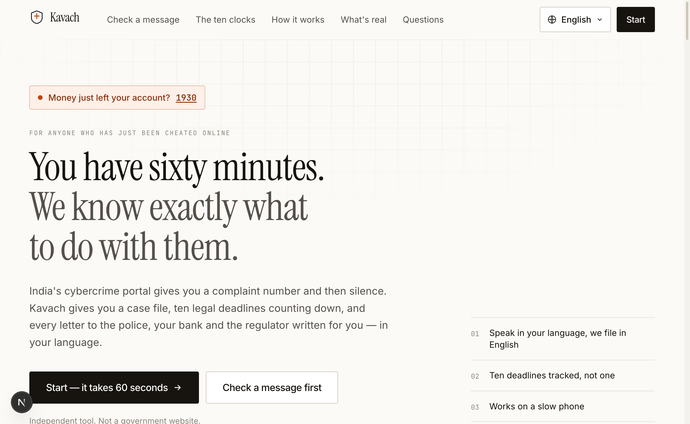
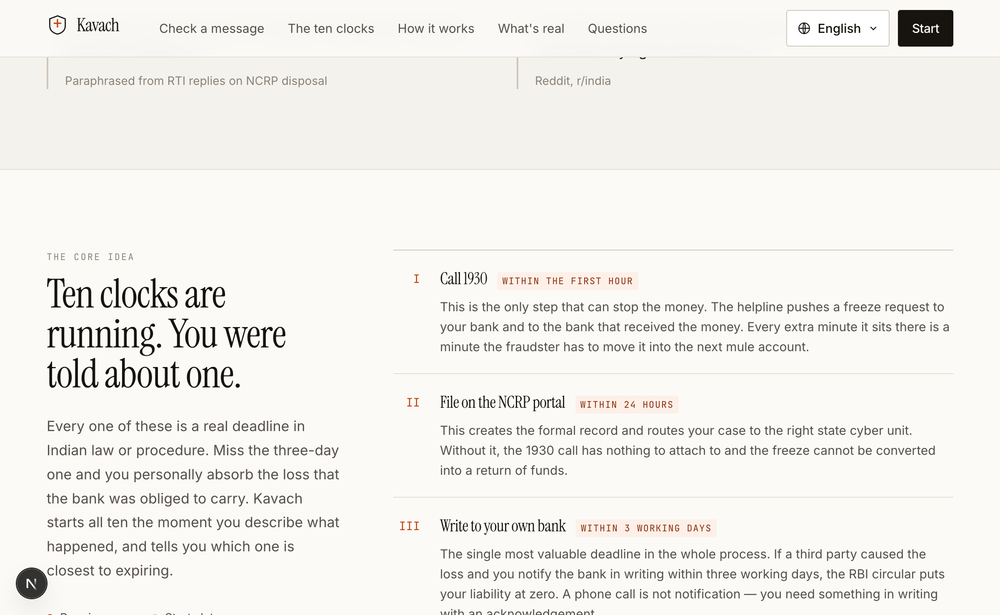
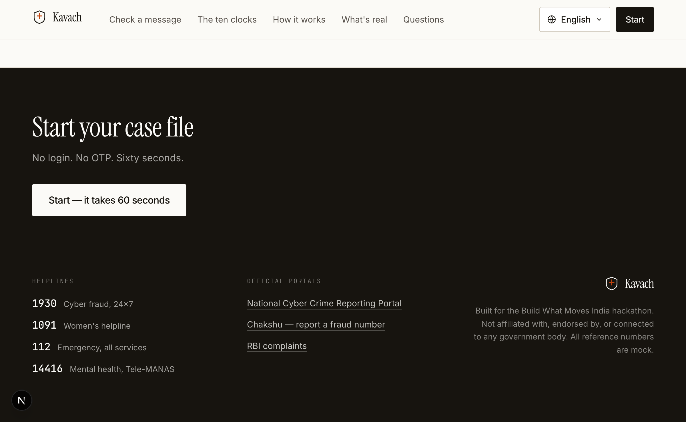
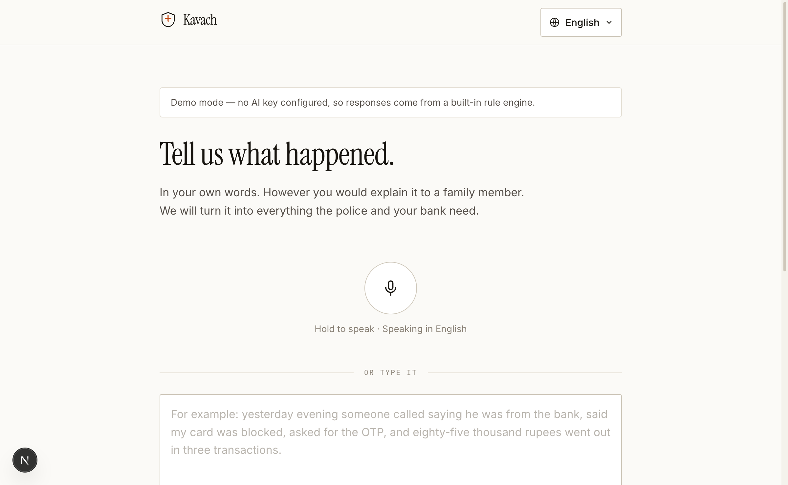
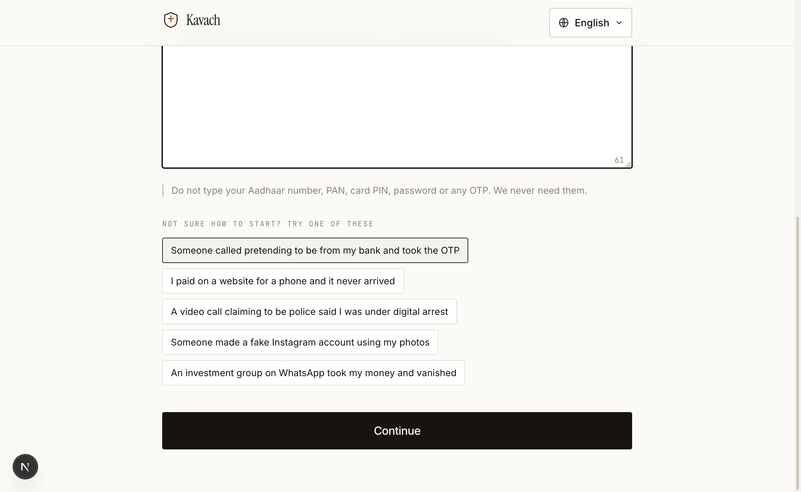
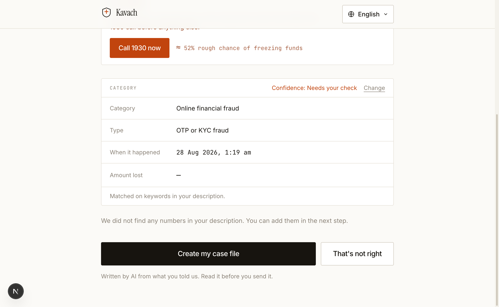
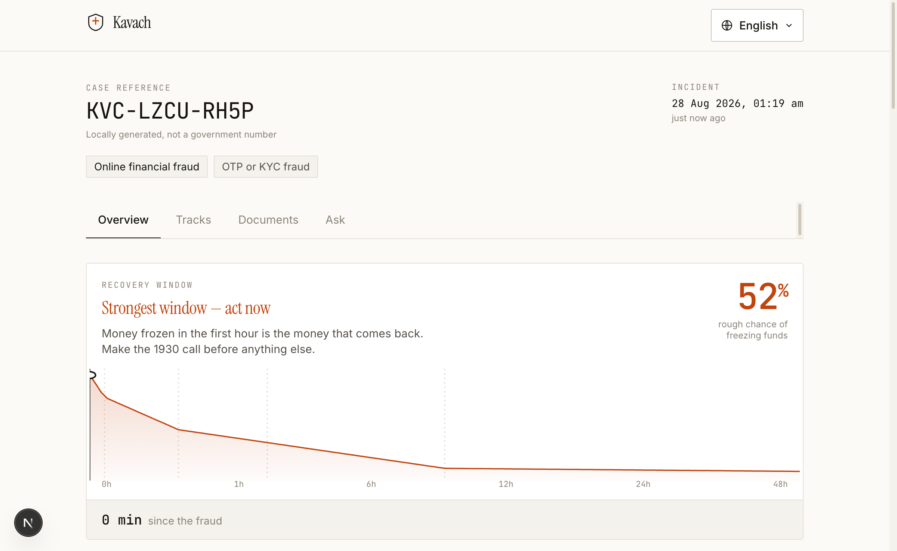
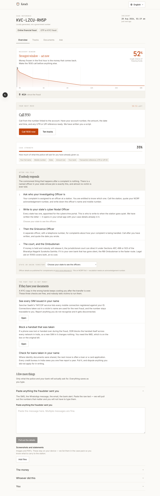
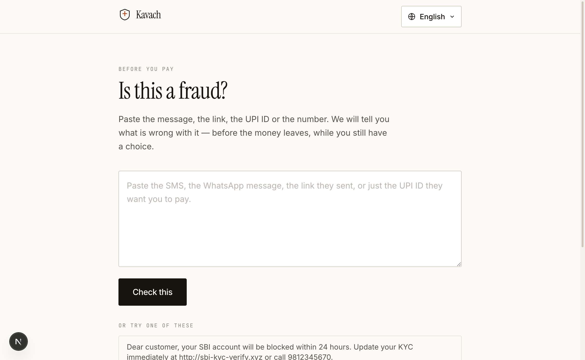

# Kavach

**From the first report to the last escalation.**

A trauma-aware cybercrime support and action-planning prototype for India. Built for the
[Build What Moves India](https://buildwhatmovesindia.com) hackathon.

**[Live Demo →](https://cybercrime-assistant.vercel.app)**

<table>
  <tr>
    <td align="center">
      <a href="https://github.com/ashusnapx">
        <br />
        <sub><b>Ashutosh Kumar</b></sub>
      </a>
    </td>
    <td align="center">
      <a href="https://github.com/ktripathi2281">
        <br />
        <sub><b>Kaustubh Tripathi</b></sub>
      </a>
    </td>
  </tr>
</table>

> Independent tool. Not affiliated with, endorsed by, or connected to any
> government body. It cannot submit anything on a citizen's behalf, and every
> reference number it generates is mock.

---

## The problem we actually went after

The obvious build here is a nicer version of the form on cybercrime.gov.in. We
started there and threw it away, because filing the complaint is roughly one
percent of the job.

What a fraud victim in India is actually facing is **a sequence of separate
actions and conditional legal clocks, and nobody hands them the list**:

| # | What has to happen | Deadline | Where it comes from |
|---|---|---|---|
| I | Call 1930 | immediately; no nationwide fixed cutoff | official I4C route for immediate cyber-financial-fraud reporting |
| II | File on the NCRP portal | as soon as possible; no nationwide 24-hour limitation | creates a complaint record and routes it to the relevant state or UT agency |
| III | **Notify your own bank in writing** | **3 working days for one conditional RBI route** | the outcome depends on whether the transaction was unauthorised, bank/customer fault and reporting time |
| IV | Ask police to record the information and register an FIR where the verified facts require it | as soon as possible | a portal complaint is *not* an FIR (BNSS s.173) |
| V | Report a suspected fraud communication on Chakshu | any time | supplies a lead to DoT for verification and possible action; it is not a crime complaint |
| VI | Provisional credit from the bank | if the unauthorised-transaction circular applies: 10 working days after III | RBI/2017-18/15, paragraph 9 |
| VII | Escalate to the RBI Ombudsman | after an unsatisfactory reply, or the applicable 30-day-or-longer wait; then a separate 90-day filing limit | Reserve Bank – Integrated Ombudsman Scheme, 2026, Clause 10 |
| VIII | Bank liability decision | if the unauthorised-transaction circular applies: 90 days after III | RBI/2017-18/15, paragraph 10 |

Track III is urgent because reporting time can affect some liability routes. It
does not itself prove zero liability: victim-approved payments, credential
sharing, bank fault and qualifying third-party breaches are treated differently.

Language, literacy, disability, fear, connectivity and the need to repeat a
distressing account can all turn a technically available portal into an
unusable journey. Authorities may still need a structured written account.
Today the victim is expected to bridge that gap between channels and institutions.

## What Kavach does

1. **Speak or type in your own language.** No login, no OTP, no captcha.
2. **Reviewable AI triage.** Suggests a category, extracts likely identifiers and
   prepares an editable English account. The citizen confirms the facts; a model
   does not decide that an offence occurred or silently file anything.
3. **A case file with ten ordered action tracks.** Only the legally sourced
   deadlines become clocks; immediate reporting actions do not become fake
   nationwide cutoffs. Prototype working-day estimates skip Sundays and the
   second and fourth Saturdays, and explicitly tell users to verify bank and
   branch holidays before relying on the date.
4. **A local evidence flight recorder.** The long-form report initially keeps
   only selected-file metadata and asks the citizen to reattach originals in
   the case Evidence Vault. Files attached in that vault are stored as actual
   browser-local bytes in IndexedDB, fingerprinted with SHA-256 and exportable;
   the fingerprint does not certify authenticity or admissibility.
5. **Channel-continuous intake.** The local WhatsApp-style preview can complete
   the same interview end to end, with familiar bubbles, replies, timestamps
   and automatic simulated delivery instead of a policy console. Its hidden
   transport model still exercises opt-in, opt-out, delivery and service-window
   rules. No message reaches Meta or WhatsApp. A real deployment must keep
   detailed allegations in protected Kavach rather than ordinary WhatsApp.
   The optional Vaani adapter separately requires explicit call, transcription
   and recording consent.
6. **Source-labelled drafts and actions.** The user gets a 1930 script, bank and
   police drafts, official links, conditional RBI screening and a printable
   evidence manifest—each clearly marked as unfiled until an official channel
   returns its own acknowledgement.

---

## Screenshots

### Landing Page

| Hero | Problem Statement | How It Works |
|------|-------------------|--------------|
|  |  |  |

| Footer & Emergency Numbers | Full Page |
|---------------------------|-----------|
|  |  |

### Voice & Text Triage

| Start Page | With Sample Input | AI Triage Result |
|------------|-------------------|------------------|
|  |  |  |

### Case File

| Case Dashboard | Full Case View | Risk Check |
|----------------|----------------|------------|
|  |  |  |

---

## Running it

```bash
npm install
cp .env.example .env.local     # add OPENAI_API_KEY for the live AI path
npm run dev
```

Case storage needs two more variables. Without them the app still runs — cases
stay in the browser exactly as they used to, and the case header says so.

```
SUPABASE_URL=https://<project>.supabase.co
SUPABASE_SECRET_KEY=sb_secret_...      # server-only; it bypasses RLS
```

Apply `supabase/migrations/*.sql` in order to a fresh project.

Vaani remains simulation-only by default. Provider credentials are not enough
to enable paid calls: the server also requires explicit live/test gates and an
exact pre-verified number allowlist. See `.env.example` and the release gates in
[`docs/PRODUCT_BLUEPRINT.md`](docs/PRODUCT_BLUEPRINT.md).

**It works with no API key.** Every AI route falls back to a deterministic rules
engine (`src/lib/ai/fallback.ts`) that classifies by keyword, extracts
candidate identifiers by regex, and fills reviewable document templates. The interface says
"demo mode" rather than implying a model ran. This is the degraded mode, not a
stub—but it creates a local case plan, not an official filing.

## How the AI is wired

`src/lib/ai/provider.ts` is a thin client written against the OpenAI HTTP API
rather than the SDK, so the same code path works against any OpenAI-compatible
endpoint. `OPENAI_BASE_URL` is the only knob — useful because the voice side is
meant to run on an Indian-language speech provider while the reasoning stays on
OpenAI.

| Route | Model | Job |
|---|---|---|
| `/api/ai/triage` | `gpt-5` | suggest category, amount and time for citizen review; render into English |
| `/api/ai/extract` | `gpt-5` | separate the *fraudster's* identifiers from the victim's |
| `/api/ai/draft` | `gpt-5` | write only the document types applicable to the confirmed case |
| `/api/ai/translate` | `gpt-5` | render a generated document into the citizen's language |
| `/api/ai/transcribe` | `gpt-4o-transcribe` | speech to text when the browser can't |
| `/api/ai/ask` | `gpt-5-mini` | answer questions grounded in the case file |

Three deliberate choices:

- **Regex runs first, and independently.** Pattern matching is useful for likely
  UTRs, phone numbers and UPI IDs, but every match still needs human review. The
  model's job is what regex cannot do: reading
  "eighty-five thousand", and deciding whether an account number belongs to the
  fraudster or the victim. We run both and merge.
- **Structured outputs, strict.** Every call uses `json_schema` with
  `strict: true`, so a response either matches our TypeScript types or we fall
  back. There is no defensive parsing of half-formed JSON in the request path.
- **Contradiction means fallback.** If a model-generated document bundle states
  the opposite of the citizen's confirmed payment-initiation answer—for
  example, turns a victim-approved transfer into “I did not authorise it”—the
  whole bundle is rejected and replaced with the deterministic, answer-backed
  templates. This is a targeted payment-fact guard, not general legal review.

The prompts (`src/lib/ai/prompts.ts`) forbid inventing a fact — anything missing
stays a `[square-bracketed placeholder]`, because a fabricated UTR number in a
police application is worse than a blank one — and forbid echoing an Aadhaar
number, PAN, PIN, password or OTP into any output.

## Languages

The picker offers all 22 languages of the Eighth Schedule plus English, with
correct scripts and RTL for Urdu, Kashmiri and Sindhi. Fonts are one Noto family
per script, `preload: false`, so a citizen reading in Tamil never downloads the
Malayalam font.

English is the source language. The 22 Eighth Schedule dictionaries are
machine-translated and explicitly labelled unreviewed. High-risk legal,
deadline and outcome claims deliberately fall back to the reviewed English
source until a native legal-language review is completed; current per-language
coverage is reported by `src/lib/i18n/loader.ts`.

Partial dictionaries fall through to English key by key rather than rendering
blank or retaining a translated claim after its legal basis changes.

## What is real, and what is mocked

**Implemented:** cases stored in Postgres and reopened on any device from their
own link — no accounts, because somebody mid-fraud should not have to invent a
password first; browser voice/text intake; a reviewable category and
identifier pass; ordered action tracks with source metadata; answer-backed RBI
screening; the RB-IOS 2026 opening/final-window calculator; applicable-document
drafts with a payment-contradiction fallback; a PDF manifest; local case
persistence; metadata-only report-form attachments followed by reattachment of
real bytes in the IndexedDB Evidence Vault; SHA-256 fingerprints; and a
stateful WhatsApp window/template/webhook/cost engine beneath a simplified,
end-to-end WhatsApp-style chat preview. The policy engine locally retains
simulated opt-out and window state, while transport controls and cost internals
are intentionally absent from the victim-facing chat.
The server-only Vaani adapter remains behind release gates; its browser request
receipt survives channel switches and same-tab reloads so an in-flight or
ambiguous callback is not started again under a fresh request ID.

**Mocked or disabled, on purpose:** nothing is submitted to cybercrime.gov.in,
police, a bank, RBI, Meta or WhatsApp; no government status is fetched; Vaani
paid calls are off unless a developer deliberately enables the restricted test
path; references are generated locally and are not government numbers. Evidence
blobs stay in IndexedDB on the device and are never uploaded, and there is no
human-support console. Local simulator state is not
proof of Meta opt-in, delivery or opt-out processing, and the Vaani browser
receipt is scoped to one browser session while server idempotency is
process-local—not a durable production call ledger.

The Evidence Vault spans two browser stores: its manifest is in `localStorage`
and its file bytes are in IndexedDB. Those stores cannot commit atomically, so a
partial attachment or removal failure can leave a stale manifest or an orphaned
blob. Full-case deletion removes the recoverable case record first, then tries
to remove its blobs and warns if cleanup cannot be confirmed. A production
system needs transactional metadata plus retryable, audited object cleanup.

This is stated on the landing page itself, not just here.

## If this were real

Kavach is an alternative to the fragmented *experience*, not a claim to replace
government registration, investigation, adjudication or emergency response.
The researched architecture, WhatsApp/Vaani plan, privacy gates and vendor
questions are in [`docs/PRODUCT_BLUEPRINT.md`](docs/PRODUCT_BLUEPRINT.md); the
law, case-law and operational basis is in
[`docs/LEGAL_BASIS.md`](docs/LEGAL_BASIS.md); the future production voice prompt
is in [`docs/VAANI_AGENT_PROMPT.md`](docs/VAANI_AGENT_PROMPT.md).

## Stack

Next.js 16 (App Router), React 19, TypeScript, Tailwind v4, jsPDF, Supabase
Postgres. No component
library, no animation library, no smooth-scroll library — the design system is
~280 lines of CSS in `src/app/globals.css`, and the "works on a slow phone"
claim on the landing page has to survive contact with the bundle.

```
src/
  app/
    page.tsx              landing
    start/                voice + text triage
    case/[id]/            the case file
    api/ai/               seven routes, each with a rules-engine fallback
  components/
    landing/  start/  case/  ui/
    LanguageSwitcher.tsx
  lib/
    ai/        provider, prompts, deterministic extraction, rules engine
    case/      types, ten tracks, legal-source metadata, local stores, PDF pack,
               the per-case key and the sync that follows every local save
    db/        service-role Postgres access, behind a key check per request
    intake/    shared web / WhatsApp / voice interview state machine
    integrations/ Vaani adapter and WhatsApp simulator
    legal/     RBI eligibility and 2026 Ombudsman calculations
    i18n/      23 languages, lazy dictionaries, script-aware fonts
```

## Helplines

**112** emergency · **1930** cyber-financial-fraud reporting · **1098** Child
Helpline · **15100** national legal-aid helpline. Verify availability and local
coverage through the linked official sources before a production release.
